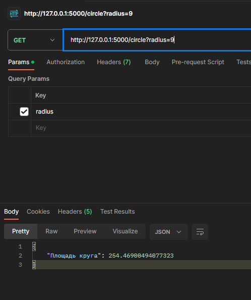
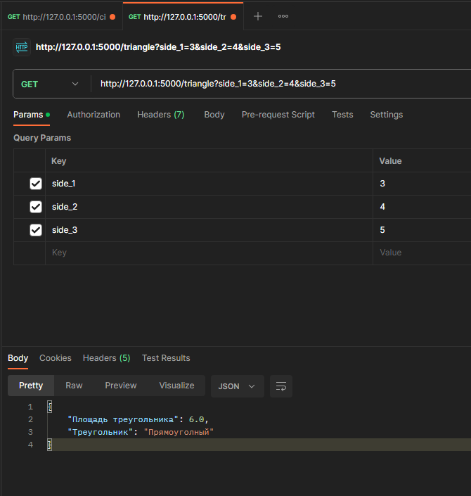

# figure_calculation

В терминале: 

1. Клонируем проект: git clone https://github.com/OlzhasKALIEV/figure_calculation.git
2. Создать ВО: python -m venv venv
3. Запуск ВО: .\venv\Scripts\activate
4. Установка зависимостей: pip install -r .\requirements.txt
5. Запуск сервера: python .\app.py run

Калькулятор для вычисления площади треугольника по трем сторонам и площади круга

Площадь круга

GET: http://127.0.0.1:5000/circle?radius=9

radius: Радиус круга

Площадь треугольника

GET: http://127.0.0.1:5000/triangle?side_1=3&side_2=4&side_3=5

side_1, side_2, side_3 стороны треугольника

запуск тестов: python -m unittest /app.py

Задание 2

В датафреймах (pyspark.sql.DataFrame) заданы продукты, категории и связь между ними. Одному продукту может соответствовать много категорий, в одной категории может быть много продуктов. Напишите метод с помощью PySpark, который вернет все продукты с их категориями (датафрейм с набором всех пар «Имя продукта – Имя категории»). В результирующем датафрейме должны также присутствовать продукты, у которых нет категорий.

файл exercise2.py
